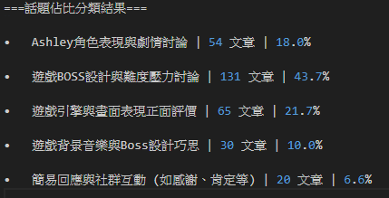

# 話題比例分類系統開發

## 目標

使用指定的 json 格式做為輸入 `list[str,str,...]`，每筆資料為一段自然語言撰寫的文章内容。此專案對這些文章進行話題分類,並統計每個話題出現的篇數與其佔整體資料的百分比。 

## 使用方法

1. 需自備 GOOGLE_API_KEY 並創建 .env 檔案並以 GOOGLE_API_KEY = "XXX" 格式儲存。  
[取得 Gemini API 金鑰](https://ai.google.dev/gemini-api/docs/api-key?hl=zh-tw)
2. 有使用到 hugging face 的開源模型，要登入帳號。(Access Tokens)
3. 此專案使用 Python = 3.10
3. 建議**創建虛擬環境**並下載相關依賴包 `pip install -r requirements.txt`，並使用以下指令運行 `python main.py`。
4. 可於網址輸入 `http://localhost:8000/docs` 進入 fastapi 提供的互動式 api 文件，進行 api 測試。  
## 範例輸出 :  

## 資料夾結構

    root_folder/  
    └── .env  
    └── .gitignore  
    └── config.yaml  
    └── requirements.txt  
    └── README.md  
    └── prompt.py  
    └── log.py  
    └── main.py  
